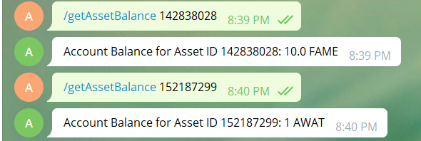
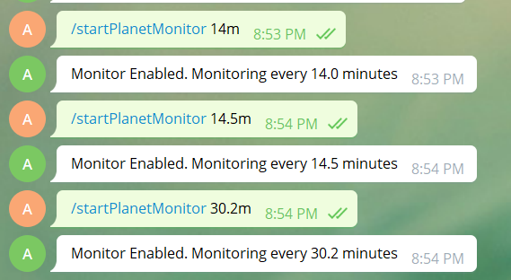
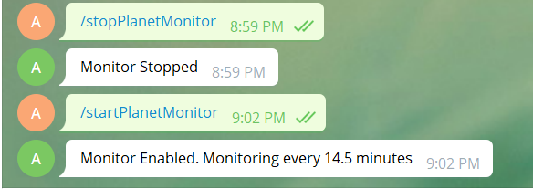
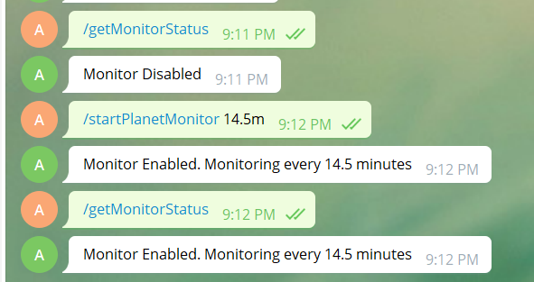

<!-- PROJECT SHIELDS -->
<!--
*** I'm using markdown "reference style" links for readability.
*** Reference links are enclosed in brackets [ ] instead of parentheses ( ).
*** See the bottom of this document for the declaration of the reference variables
*** for contributors-url, forks-url, etc. This is an optional, concise syntax you may use.
*** https://www.markdownguide.org/basic-syntax/#reference-style-links
-->
[![Contributors][contributors-shield]][contributors-url]
[![Forks][forks-shield]][forks-url]
[![Stargazers][stars-shield]][stars-url]
[![Issues][issues-shield]][issues-url]
[![AGPL License][license-shield]][license-url]
[![LinkedIn][linkedin-shield]][linkedin-url]


<!-- PROJECT LOGO -->
<br />

<p align="center">
  <a href="https://github.com/avislash/algowatcher">
    
  </a>
  <h3 align="center">AlgoWatcher</h3>

  <p align="center">
    A Telegram Bot for querying and monitoring an address the Algorand Blockchain 
    <br />
    <a href="https://github.com/avislash/algowatcher/issues">Report Bug</a>
    ·
    <a href="https://github.com/avislash/algowatcher/issues">Request Feature</a>
  </p>


<!-- TABLE OF CONTENTS -->

<details open="open">
  <summary><h2 style="display: inline-block">Table of Contents</h2></summary>
  <ol>
    <li>
      <a href="#about-the-project">About The Project</a>
      <ul>
        <li><a href="#built-with">Built With</a></li>
      </ul>
    </li>
    <li>
      <a href="#getting-started">Getting Started</a>
      <ul>
        <li><a href="#prerequisites">Prerequisites</a></li>
        <li><a href="#installation">Installation</a></li>
      </ul>
    </li>
    <li><a href="#usage">Usage</a></li>
    <li><a href="#roadmap">Roadmap</a></li>
    <li><a href="#contributing">Contributing</a></li>
    <li><a href="#license">License</a></li>
    <li><a href="#contact">Contact</a></li>
    <li><a href="#acknowledgements">Acknowledgements</a></li>
  </ol>
</details>


<!-- ABOUT THE PROJECT -->
## About The Project
AlgoWatcher is a Telegram bot designed to allow users of the Telegram Messaging platform to query balances and monitor transactions on the Algorand blockchain. This bot is designed to monitor the flow of Planets into an Algorand Public Address and alert the user if it detects disruptions to that flow.


### Built With

* [py-algorand-sdk](https://github.com/algorand/py-algorand-sdk)
* [python-telegram-bot](https://github.com/python-telegram-bot/python-telegram-bot)


<!-- GETTING STARTED -->
## Getting Started

To get a local copy up and running follow these simple steps.

### Prerequisites 
The Algorand Python SDK must be installed.  This can be installed via pip3.
```
pip3 install py-algorand-sdk 
```
Refer to [py-algorand-sdk](https://github.com/algorand/py-algorand-sdk) for alternative installation methods.

The Python Telegram Bot Package must also be installed.  This can be installed via pip3.
```
pip3 install python-telegram-bot --upgrade
```
Refer to [python-telegram-bot](https://github.com/python-telegram-bot/python-telegram-bot) for alternative installation methods.

### Installation

1. Clone the repo
   ```sh
   git clone https://github.com/avislash/algowatcher.git
   ```
2. Modify algowatcher.py to have the appropriate Algorand Node Address and API Key and Telegram Bot API key. These can be either hard coded or stored in a pickle file and read into the program. 

 3.) Run via ```$python3 ./algowatcher.py```


<!-- USAGE EXAMPLES -->
## Usage

To use AlgoWatcher send a <b>/start </b>Telegram message to [@algowatcher](t.me/algowatcherbot) . 

The <b>/start</b> command displays all the commands available to the user as well as a brief description


To get started register an Algorand Public address to query and/or monitor via  <b>/address  ADDRESS </b>  


Now that the address has been set,  you can use the AlgoWatcher bot to check the current number of Algo that the address has via <b>/getAlgoBalance</b>


AlgoWatcher can be used to get the amount of Planets (an Algorand Special Asset [ASA]) in the address as well with <b>/getPlanetBalance</b>  


In addition to Planets, AlgoWatcher can get the amount of any valid ASA registered to the Algorand Address by using <b>/getAssetBalance ASSET_ID</b>




To setup Planet Monitoring use the **/startPlanetMonitor** command.  

 


When no inputs are supplied to the **/startPlanetMonitor** command then the last set interval is used (note: The default interval is 30seconds and is set when using the **/address** command). 


To change the interval use 

**/startPlanetMonitor INTERVALs**  to specify the interval in **seconds**  or


**/startPlanetMonitor INTERVALm**  to specify the interval in minutes



Note: The Planet Monitor only accepts inputs of seconds and minutes at this time since that covers the frequency range of how quickly Planets are issued to Algorand Accounts by PlanetWatch. The bot can be updated to accommodate input of hours and days as well should the community decide it.  


Once started the Planet Monitor will alert the user at the specified interval if it does not detect any new Planets coming in.


To stop the Planet monitor use **/stopPlanetMonitor**


After stopping the Planet Monitor, the **/startPlanetMonitor** command can be used at any time to start the Planet Monitor back up either at the last set interval or a newly specified one. The monitoring interval can also be changed at any time without needing to stop monitor.




The **/getMonitorStatus** command can be used to check the state of the Planet Monitor at any time




<!-- ROADMAP -->

## Roadmap

See the [open issues](https://github.com/avislash/algowatcher/issues) for a list of proposed features (and known issues).


<!-- CONTRIBUTING -->
## Contributing

Contributions are what make the open source community such an amazing place to be learn, inspire, and create. Any contributions you make are **greatly appreciated**.

1. Fork the Project
2. Create your Feature Branch (`git checkout -b feature/AmazingFeature`)
3. Commit your Changes (`git commit -m 'Add some AmazingFeature'`)
4. Push to the Branch (`git push origin feature/AmazingFeature`)
5. Open a Pull Request


<!-- LICENSE -->
## License

See `LICENSE` for more information.


<!-- CONTACT -->
## Contact

Avi Misra - | Email: avi@algowatcher.net | Telegram Handle: [@avislash](t.me/avislash)


AlgoWatcher Bot Telegram Handle - [@AlgoWatcher](t.me/algowatcherbot)

AlgoWatcher Telegram Group - [@AlgoWatchers](t.me/algowatchers)


Project Link: [https://github.com/avislash/algowatcher](https://github.com/avislash/algowatcher)


<!--- Additional Documents and Resources -->

## Additional Documents & Resources

- [Algorand Developers Portal](https://developer.algorand.org/)

  - [Workspace Setup](https://developer.algorand.org/docs/build-apps/setup/) - This provides a great introduction and overview of the Algorand Developer Tools and Workspace
  - [Hello World Transaction](https://developer.algorand.org/docs/build-apps/hello_world/) - This is provides a great example (in many languages) of how to do a transaction on the Algorand Network

- [Your First Telegram Bot](https://github.com/python-telegram-bot/python-telegram-bot/wiki/Extensions-%E2%80%93-Your-first-Bot)

  - Great overview of the Python Telegram Bot SDK and provides a great overview of how to register a Bot in Telegram and hook it in with the Python Telegram Bot SDK. 

  


<!-- MARKDOWN LINKS & IMAGES -->
<!-- https://www.markdownguide.org/basic-syntax/#reference-style-links -->
[contributors-shield]: https://img.shields.io/github/contributors/avislash/repo.svg?style=for-the-badge
[contributors-url]: https://github.com/avislash/algowatcher/graphs/contributors
[forks-shield]: https://img.shields.io/github/forks/avislash/repo.svg?style=for-the-badge
[forks-url]: https://github.com/avislash/algowatcher/network/members
[stars-shield]: https://img.shields.io/github/stars/avislash/repo.svg?style=for-the-badge
[stars-url]: https://github.com/avislash/algowatcher/stargazers
[issues-shield]: https://img.shields.io/github/issues/avislash/repo.svg?style=for-the-badge
[issues-url]: https://github.com/avislash/algowatcher/issues
[license-shield]: https://img.shields.io/github/license/avislash/repo.svg?style=for-the-badge
[license-url]: https://github.com/avislash/algowatcher/blob/master/LICENSE.txt
[linkedin-shield]: https://img.shields.io/badge/-LinkedIn-black.svg?style=for-the-badge&logo=linkedin&colorB=555
[linkedin-url]: https://www.linkedin.com/in/avinash-misra-23825539/
